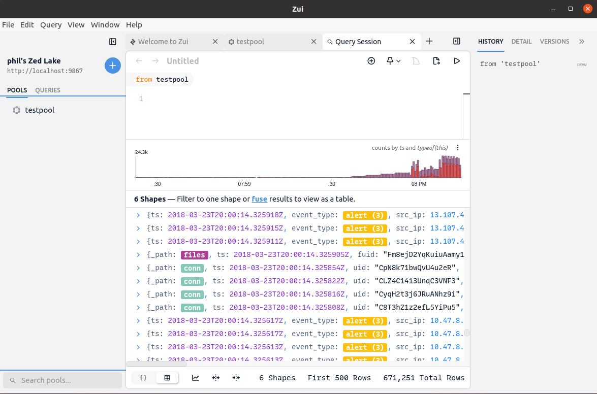
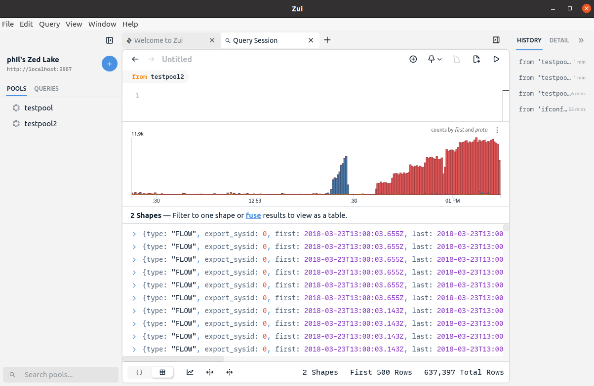

# Custom `brimcap load` Configuration

- [Summary](#summary)
- [Custom Zeek/Suricata Analyzers](#custom-zeeksuricata-analyzers)
  * [Background](#background)
  * [Base Zeek/Suricata Installation](#base-zeeksuricata-installation)
  * [Example Configuration](#example-configuration)
- [Custom NetFlow Analyzer](#custom-netflow-analyzer)
  * [Background](#background-1)
  * [Base nfdump Installation](#base-nfdump-installation)
  * [Example Configuration](#example-configuration-1)
- [Contact us!](#contact-us)

# Summary

When used out-of-the-box in a default configuration, `brimcap load` invokes
Zeek and Suricata binaries that are bundled with Brimcap to generate
richly-typed summary logs from pcap files. However, one of Brimcap's strengths
is its ability to invoke any arbitrary combination of such "analyzers" that
generate logs from pcaps. These analyzers could be alternate Zeek or Suricata
installations that you've customized or other pcap-processing tools of your
choosing.

This article describes such example custom configurations. The first section
focuses on recreating Brimcap configurations equivalent to those created with
the customization options in Brim app release `v0.24.0` and older. The second
section builds on the approach to create a custom Brimcap configuration that
generates NetFlow records from pcaps.

# Custom Zeek/Suricata Analyzers

## Background

Brim release `v0.25.0` bundles Zeek and Suricata binaries differently than
`v0.24.0`. A brief summary:

* **`v0.24.0` and older** - The "backend" `zqd` process that ran behind the
Brim app handled the launching of Zeek and Suricata binaries each time a pcap
was imported. The launch of these processes was done via "runner" scripts that
ensured appropriate pathnames and environment variables were set for them to
run successfully. A [Zeek Customization](https://github.com/brimdata/brim/wiki/Zeek-Customization)
article described how an alternate "Zeek Runner" script could be
created/invoked such that Brim would launch Zeek from an install different than
the one bundled with Brim. A similar option existed to invoke an alternate
"Suricata Runner" (as well as a "Suricata Updater" for updating
[rules](https://suricata.readthedocs.io/en/suricata-6.0.0/rules/)) however
these were never fully documented.

* **`v0.25.0` and newer** - Brimcap is now bundled as part of Brim. Brimcap
includes Zeek and Suricata binaries equivalent to those that were bundled with
Brim `v0.24.0` and older, however they are no longer launched by the Zed
backend. Instead Brim now runs `brimcap load` for each pcap imported into the
app. In a default configuration, `brimcap load` invokes runner scripts
that point to the Zeek/Suricata binaries that are bundled with Brimcap,
effectively providing an out-of-the-box experience equivalent to what is
possible in Brim `v0.24.0`. However, for custom configurations, Brimcap
provides a YAML-based configuration that allows for flexibly invoking alternate
Zeek/Suricata installations and/or alternate pcap processing tools.

## Base Zeek/Suricata Installation

The goal in our first example customization will be to run Brim with the latest
GA binary releases of [Zeek](https://github.com/zeek/zeek/wiki/Binary-Packages)
and [Suricata](https://suricata.readthedocs.io/en/suricata-6.0.0/install.html#install-binary-packages),
as these are newer than the versions that currently ship with Brimcap. We'll
use Linux Ubuntu 18.04 as our OS platform. On such a host, the following
commands install these from common repositories and ensure the binaries are in
the `$PATH`.

```
sudo add-apt-repository -y ppa:oisf/suricata-stable
echo 'deb http://download.opensuse.org/repositories/security:/zeek/xUbuntu_18.04/ /' | sudo tee /etc/apt/sources.list.d/security:zeek.list
curl -fsSL https://download.opensuse.org/repositories/security:zeek/xUbuntu_18.04/Release.key | gpg --dearmor | sudo tee /etc/apt/trusted.gpg.d/security_zeek.gpg > /dev/null
sudo apt -y update
sudo apt -y --no-install-recommends install suricata zeek jq
sudo suricata-update
sudo chmod go+rx /var/lib/suricata /var/lib/suricata/rules
export PATH="/opt/zeek/bin:$PATH"
```

Note that the Zeek/Suricata installations bundled with Brimcap include some
additional customizations that will not be present in out-of-the-box GA
packages like we've just installed here. Recreating a fully equivalent
installation is outside of the scope of this article and may not even match
your goals in running a custom configuration. To avoid surprises, here's a
brief summary of known differences to expect, which you may want to address via
additional customizations.

1. The Brimcap-bundled Zeek includes the additional packages
[geoip-conn](https://github.com/brimdata/geoip-conn),
[zeek-community-id](https://github.com/corelight/zeek-community-id),
[HASSH](https://github.com/salesforce/hassh),
and [JA3](https://github.com/salesforce/ja3). These would typically be
installed via [Zeek Package Manager](https://docs.zeek.org/projects/package-manager/en/stable/quickstart.html).

2. The Brimcap-bundled Suricata includes a
[YAML configuration](https://github.com/brimdata/build-suricata/blob/master/brim-conf.yaml)
that (among other things) enables the `community_id` field, which is essential
for joining to the `community_id` field in Zeek events that may give context
about why the alert fired. This is achieved in the bundled Suricata YAML
configuration by setting
[`community-id: yes`](https://github.com/brimdata/build-suricata/blob/853fab6d7c21325f57e113645004b1107b78d840/brim-conf.yaml#L51-L52) and JSON
[`escape-slash: no`](https://github.com/brimdata/build-suricata/blob/853fab6d7c21325f57e113645004b1107b78d840/brim-conf.yaml#L80-L81)
for the `eve-log` output.

3. To ensure [rules](https://suricata.readthedocs.io/en/suricata-6.0.0/rules/)
are kept current, the Brim app invokes the bundled "Suricata Updater" once
each time it is opened. However, in a custom configuration, no attempt is made
to trigger updates on your behalf. You may choose to to periodically run your
`suricata-update` manually or consider a scheduled mechanism such as `cron`.

## Example Configuration

For use with the Zeek/Suricata we just installed, a sample
[Brimcap YAML configuration](https://github.com/brimdata/brimcap/blob/main/examples/zeek-suricata.yml)
and accompanying wrapper scripts for [Zeek](https://github.com/brimdata/brimcap/blob/main/examples/zeek-wrapper.sh)
and [Suricata](https://github.com/brimdata/brimcap/blob/main/examples/suricata-wrapper.sh)
are available in the Brimcap repo. If Brim is running and all scripts/binaries
invoked are in the `$PATH`, the configuration can be tested outside the app to
import a `sample.pcap` like so:

```
$ /opt/Brim/resources/app.asar.unpacked/zdeps/zed api new testpool
$ /opt/Brim/resources/app.asar.unpacked/zdeps/brimcap load -root "$HOME/.config/Brim/data/brimcap-root" -config zeek-suricata.yml -p testpool sample.pcap
```

* **Note**: The `zdeps` directory that contains the `zed` and `brimcap`
binaries varies per platform.

|**OS Platform**|**Location**|
|---------------|------------|
| **Windows**   | `%USERPROFILE%\AppData\Local\Programs\Brim\resources\app.asar.unpacked\zdeps` |
| **macOS**     | `/Applications/Brim.app/Contents/Resources/app.asar.unpacked/zdeps` |
| **Linux**     | `/opt/Brim/resources/app.asar.unpacked/zdeps` |

If successful, the new pool will appear in Brim, allowing you to browse the
logs and open flows from the pcap via the **Packets** button.



The same `brimcap load` command line can be used to incrementally add more logs
to the same pool for additional pcaps, which was not possible pre-Brimcap. The
setting in the Brim **Preferences** for the **Brimcap Custom YAML Path** can
also be pointed at the path to this configuration file, which will cause it to
be invoked when you open or drag pcap files into Brim.

In examining the example Brimcap YAML, we see at the top that we've defined two
`analyzers`.

```
analyzers:
  - cmd: zeek-wrapper.sh
  - cmd: suricata-wrapper.sh
```

A Brimcap analyzer has the following characteristics:

1. It expects pcap input to be streamed to it via standard input (stdin)
2. It's expected to output log files that can be further processed as soon as
lines are appended to them (i.e. `tail` could process them)
3. Additional per-analyzer options can be used to affect which generated logs
are loaded and what additional processing is performed on them

The analyzer invoked by Brimcap is a wrapper script as referenced in the YAML.
In addition to taking input on stdin, it also sets Zeek to ignore checksums
(since these are often set incorrectly on pcaps) and we also disable a couple
of the excess log outputs. This is very similar to the Zeek Runner script that
was included with Brim `v0.24.0`.

```
$ cat zeek-wrapper.sh 
#!/bin/bash
zeek -C -r - --exec "event zeek_init() { Log::disable_stream(PacketFilter::LOG); Log::disable_stream(LoadedScripts::LOG); }" local
```

We use a similar wrapper for Suricata, but here we perform some additional
steps to work around a known Suricata bug [#4106](https://redmine.openinfosecfoundation.org/issues/4106).
This bug causes EVE JSON events to be output that contain duplicate keys, which
Zed is not currently equipped to tolerate ([zed/2523](https://github.com/brimdata/zed/issues/2523)). We therefore pipe the EVE JSON data through [`jq`](https://stedolan.github.io/jq/),
which has the effect of deduplicating these references. Shell pipeline
additions such that this illustrate the kinds of processing you may want to
invoke in your Brimcap customizations, as this may prove useful not just for
working around bugs but also for providing enhanced functionality.

```
$ cat suricata-wrapper.sh 
#!/bin/bash
suricata -r /dev/stdin
cat eve.json | jq -c . > deduped-eve.json
```

Revisiting our Brimcap YAML configuration, we see this output file is
referenced in a `globs:` setting. This setting can be used to specify one or
more [glob](https://en.wikipedia.org/wiki/Glob_(programming))-style wildcards
that isolate a subset of the log outputs from the analyzer that should be
processed. In this case it was important to only target this "deduped" log
file, since otherwise the original `eve.json` would still have been processed
and the error due to the presence of the duplicate fields would have halted the
`brimcap load`.

```
analyzers:
...
  - cmd: suricata-wrapper.sh
    globs: ["deduped*.json"]
```

What follows below the `globs:` setting is a Zed shaper configuration. Whereas
the Zeek TSV logs contain Zed-compatible rich data types (timestamps, IP
addresses, etc.), since Suricata's EVE logs are JSON, here we use this shaper
config to assign better data types as the JSON is being converted for storage
into the Zed Lake. Out-of-the-box, Brimcap automatically applies this same
shaping configuration on the EVE output generated from its bundled Suricata.
Here it's broken out and made part of the configuration YAML such that you can
further modify it to suit your needs.
```
    shaper: |
      type alert = {
        timestamp: time,
        event_type: bstring,
        src_ip: ip,
        src_port: port=(uint16),
        dest_ip: ip,
        dest_port: port=(uint16),
        vlan: [uint16],
        proto: bstring,
        app_proto: bstring,
        alert: {
          severity: uint16,
          signature: bstring,
          category: bstring,
          action: bstring,
          signature_id: uint64,
          gid: uint64,
          rev: uint64,
          metadata: {
            signature_severity: [bstring],
            former_category: [bstring],
            attack_target: [bstring],
            deployment: [bstring],
            affected_product: [bstring],
            created_at: [bstring],
            performance_impact: [bstring],
            updated_at: [bstring],
            malware_family: [bstring],
            tag: [bstring]
          }
        },
        flow_id: uint64,
        pcap_cnt: uint64,
        tx_id: uint64,
        icmp_code: uint64,
        icmp_type: uint64,
        tunnel: {
          src_ip: ip,
          src_port: port=(uint16),
          dest_ip: ip,
          dest_port: port=(uint16),
          proto: bstring,
          depth: uint64
        },
        community_id: bstring
      }
      filter event_type=alert | put . = shape(alert) | rename ts=timestamp
```

A full description of all that's possible with shaping configurations is beyond
the scope of this article. However, this configuration is quite simple and can
be described in brief.

1. The `type alert` defines the names, [data types](https://github.com/brimdata/zed/blob/main/docs/formats/zson.md#33-primitive-values),
and hierarchical locations of expected fields in the input records. Here we've
defined a single "wide" shape for _all_ alerts we've known Suricata to
generate, which is convenient because it allows Brim to easily display them in
columnar format.

2. The `filter event_type=alert` trims the processed EVE events to only alerts.
If you want to let through more Suricata data besides just alerts, you could
remove this part of the pipeline. If so, you'll likely want to explore the
additional data and create shapers to apply proper data types to them, since
this will be a prerequisite for doing certain Zed queries with the data (e.g.
a successful CIDR match requires IP addresses to be stored as `ip` type, not
the string type in which they'd appear in unshaped JSON).

3. The `put . = shape(alert)` applies the shape of the `alert` type to each
input record. With what's shown here, additional fields that appear beyond
those specified in the shaper (e.g. as the result of new Suricata features or
your own customizations) will still be let through this pipeline and stored in
the Zed Lake. If this is undesirable, add `| put . = crop(alert)` downstream of
the first `put`, which will trim these additional fields.

4. The `rename ts=timestamp` changes the name of Suricata's `timestamp` field
to match the `ts` one used by Zeek, which allows the data from both sources to
be more seamlessly presented together in Brim.

# Custom NetFlow Analyzer

## Background

Building on what we just learned about Brimcap analyzers, we can extend the
concepts to pcap processing tools other than Zeek or Suricata. In this case
we'll use NetFlow records generated using the open source
[nfdump](https://github.com/phaag/nfdump) toolset.

* **Note**: While the example shows how shaped NetFlow records can be loaded
via Brimcap, the **Packets** button in Brim is not currently wired to extract
flows from a pcap via the 5-tuple and time details in NetFlow records. If this
is functionality you're interested in pursuing, please
[open an issue](https://github.com/brimdata/brimcap/wiki/Troubleshooting#opening-an-issue)
or come talk to us on [public Slack](https://www.brimsecurity.com/join-slack/).

## Base nfdump Installation

To build and install the nfdump toolset with the commands we'll need to
generate NetFlow, we execute the following on our Linux host:

```
sudo apt install automake libtool pkg-config flex bison libbz2-dev
git clone https://github.com/phaag/nfdump.git && cd nfdump
./autogen.sh
./configure --enable-nfpcapd
sudo make install
export LD_LIBRARY_PATH="/usr/local/lib"
```

## Example Configuration

As we did with Zeek and Suricata, we create a wrapper script to act as our
Brimcap analyzer. It works in two phases, first creating binary NetFlow records
and then converting them to CSV. `nfpcapd` only accepts a true pcap file input
(not a device like `/dev/stdin`), so we first store the incoming pcap in a
temporary file. We also use GNU `head` to trim out some trailing summary lines
that `nfdump` appends by default which would trip up the Zed CSV reader.

```
$ cat nfdump-wrapper.sh 
TMPFILE=$(mktemp)
cat - > "$TMPFILE"
nfpcapd -r "$TMPFILE" -l .
rm "$TMPFILE"
for file in nfcapd.*
do
  nfdump -r $file -o csv | head -n -3 | zq -i csv -f ndjson - > ${file}.ndjson
done
```

This script is called from our Brimcap config YAML, which includes a
`globs:` setting to target only the CSV files and also a Zed shaper to apply
rich data types.

```
$ cat nfdump.yml 
analyzers:
  - cmd: nfdump-wrapper.sh
    # The globs being set to "*.ndjson" is a workaround for the fact that our
    # current JSON reader won't accept much data and we can't tell
    # brimcap load to expect CSV input, so we're postprocessing in the
    # nfdump-wrapper.sh script with zq to turn the CSV back into NDJSON.
    globs: ["*.ndjson"]
    shaper: |
      type netflow = {
        ts: time,
        te: time,
        td: duration,
        sa: ip,
        da: ip,
        sp: uint16,
        dp: uint16,
        pr: string,
        flg: string,
        fwd: bytes,
        stos: bytes,
        ipkt: uint64,
        ibyt: uint64,
        opkt: uint64,
        obyt: uint64,
        \in: uint64,
        out: uint64,
        sas: uint64,
        das: uint64,
        smk: uint8,
        dmk: uint8,
        dtos: bytes,
        dir: uint8,
        nh: ip,
        nhb: ip,
        svln: uint16,
        dvln: uint16,
        ismc: string,
        odmc: string,
        idmc: string,
        osmc: string,
        mpls1: string,
        mpls2: string,
        mpls3: string,
        mpls4: string,
        mpls5: string,
        mpls6: string,
        mpls7: string,
        mpls8: string,
        mpls9: string,
        mpls10: string,
        cl: float64,
        sl: float64,
        al: float64,
        ra: ip,
        eng: string,
        exid: bytes,
        tr: time
      }
      // The leading "put tr=time(tr)" is a workaround to zed/2670
      put tr=time(tr) | put . = shape(netflow)
```

Putting it all together, we can test it by creating a new pool and then running
`brimcap load` to import a sample pcap.

```
$ /opt/Brim/resources/app.asar.unpacked/zdeps/zed api new testpool2
$ /opt/Brim/resources/app.asar.unpacked/zdeps/brimcap load -root "$HOME/.config/Brim/data/brimcap-root" -config nfdump.yml -p testpool2 sample.pcap
```

Our pool is now ready to be queried in Brim.


# Contact us!

If you're running custom Brimcap configurations, we'd like to hear from you!
Whether you've perfected a custom combination of analyzers that you think other
Brim users will find useful, or (especially) if you hit challenges and need
help, please join our [public Slack](https://www.brimsecurity.com/join-slack/)
and tell us about it, or [open an issue](https://github.com/brimdata/brimcap/wiki/Troubleshooting#opening-an-issue).
Thanks!
